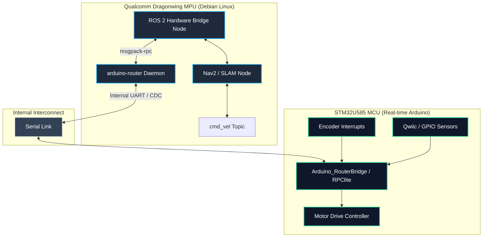
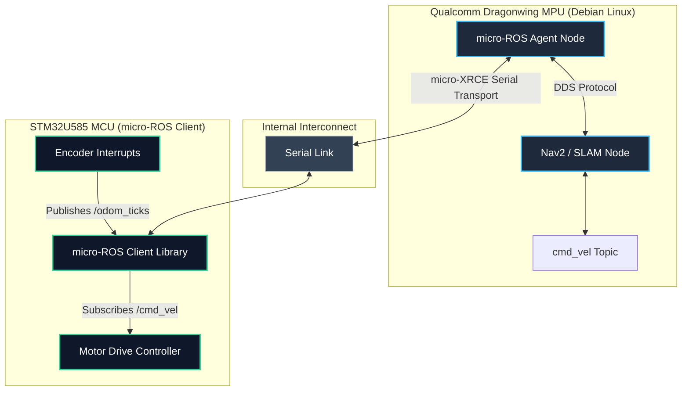

# ROS 2 System Architecture for Arduino UNO Q

The **Arduino UNO Q** is a hybrid "dual-brain" development board that combines a Linux-capable microcomputer (Qualcomm Dragonwing QRB2210 SoC MPU) running Debian Linux with a real-time microcontroller (STM32U585 MCU). 

This architecture makes it exceptionally well-suited for advanced robotics. Unlike standard Arduino boards that require an external computer to run ROS, the UNO Q can host the entire ROS 2 stack locally on its MPU while utilizing the MCU for real-time motor control, encoder tracking, and hardware pin interfaces.

There are two primary architectures to integrate ROS 2 on the Arduino UNO Q:
1. **Architecture A: The RPC Router Bridge (Recommended for rapid development)**
2. **Architecture B: Native micro-ROS (Recommended for native ROS 2 node-to-node communication)**

---

## Architectural Comparison

| Feature | Architecture A: RPC Router Bridge | Architecture B: Native micro-ROS |
| :--- | :--- | :--- |
| **Concept** | MPU runs a ROS 2 node that communicates via RPC/MessagePack with an MCU sketch. | MCU runs a native ROS 2 client, communicating directly with a ROS 2 Agent on the MPU. |
| **Complexity** | **Low**. Uses official Arduino libraries (`Arduino_RouterBridge` / `Arduino_RPClite`). | **Medium-High**. Requires configuring micro-ROS library with Zephyr or FreeRTOS on the MCU. |
| **Real-time Control** | Excellent. MCU runs standard Arduino loops with low-latency execution. | Excellent. micro-ROS tasks run deterministically alongside control loops. |
| **ROS Native on MCU** | No. MCU is unaware of ROS concepts (topics, services, TF). | Yes. MCU code creates publishers, subscribers, and services directly. |
| **Communication Overhead** | Low. Minimal serialized RPC call packets. | Medium. DDS/XRCE middleware overhead on serial link. |

---

## Architecture A: The RPC Router Bridge

In this design, the MPU hosts the standard ROS 2 nodes and a custom "Hardware Bridge Node" written in Python. This bridge node talks to the `arduino-router` daemon running on Debian. The MCU registers RPC functions that are called by the bridge node over the internal serial interface.

### System Diagram



### 1. MCU Code Example (C++)
The following sketch runs on the STM32U585 MCU. It registers RPC handlers using the official `Arduino_RouterBridge` library to control motors and return sensor data.

```cpp
#include <Arduino.h>
#include <Arduino_RouterBridge.h>

// Define motor output pins
const int MOTOR_L_PWM = 5;
const int MOTOR_L_DIR = 4;
const int MOTOR_R_PWM = 6;
const int MOTOR_R_DIR = 7;

// Variables to track encoders
volatile long left_encoder_ticks = 0;
volatile long right_encoder_ticks = 0;

// Interrupt Service Routines for Encoders
void leftEncoderISR() { left_encoder_ticks++; }
void rightEncoderISR() { right_encoder_ticks++; }

// RPC Callback: Sets motor speeds
void setMotorSpeeds(int left_speed, int right_speed) {
  // Left Motor Control
  digitalWrite(MOTOR_L_DIR, left_speed >= 0 ? HIGH : LOW);
  analogWrite(MOTOR_L_PWM, abs(left_speed));

  // Right Motor Control
  digitalWrite(MOTOR_R_DIR, right_speed >= 0 ? HIGH : LOW);
  analogWrite(MOTOR_R_PWM, abs(right_speed));
}

// RPC Callback: Returns current encoder ticks
std::pair<long, long> getEncoderTicks() {
  return {left_encoder_ticks, right_encoder_ticks};
}

void setup() {
  pinMode(MOTOR_L_PWM, OUTPUT);
  pinMode(MOTOR_L_DIR, OUTPUT);
  pinMode(MOTOR_R_PWM, OUTPUT);
  pinMode(MOTOR_R_DIR, OUTPUT);
  
  // Attach encoder interrupts
  attachInterrupt(digitalPinToInterrupt(2), leftEncoderISR, RISING);
  attachInterrupt(digitalPinToInterrupt(3), rightEncoderISR, RISING);

  // Initialize the bridge communication channel
  Bridge.begin();

  // Register RPC methods for the MPU to call
  Bridge.provide("set_motor_speeds", setMotorSpeeds);
  Bridge.provide("get_encoder_ticks", getEncoderTicks);
}

void loop() {
  // Process incoming RPC commands in the background
  delay(10); 
}
```

### 2. MPU Bridge Node Example (Python)
This ROS 2 node runs on the Debian side of the UNO Q. It subscribes to `/cmd_vel` and calls the `set_motor_speeds` RPC function on the MCU, while polling the encoder values and publishing them to `/odom_ticks`.

```python
import rclpy
from rclpy.node import Node
from geometry_msgs.msg import Twist
from std_msgs.msg import Int64MultiArray
import msgpackrpc  # MessagePack RPC client library

class UnoQHardwareBridge(Node):
    def __init__(self):
        super().__init__('uno_q_hardware_bridge')
        
        # Connect to the local arduino-router daemon via MessagePack-RPC
        # The daemon typically runs on localhost (port 9000 or custom)
        try:
            self.rpc_client = msgpackrpc.Client(msgpackrpc.Address("127.0.0.1", 9000))
            self.get_logger().info("Connected to arduino-router RPC bridge successfully.")
        except Exception as e:
            self.get_logger().error(f"Failed to connect to RPC bridge: {e}")

        # Subscriptions & Publishers
        self.cmd_vel_sub = self.create_subscription(Twist, 'cmd_vel', self.cmd_vel_callback, 10)
        self.ticks_pub = self.create_publisher(Int64MultiArray, 'odom_ticks', 10)
        
        # Timer to poll encoder data from the MCU (50Hz)
        self.poll_timer = self.create_timer(0.02, self.poll_hardware)

    def cmd_vel_callback(self, msg: Twist):
        # Convert differential drive velocities to PWM commands (-255 to 255)
        linear = msg.linear.x
        angular = msg.angular.z
        
        # Simple differential kinematics mapping
        left_speed = int((linear - angular) * 255)
        right_speed = int((linear + angular) * 255)
        
        # Clamp values
        left_speed = max(-255, min(255, left_speed))
        right_speed = max(-255, min(255, right_speed))
        
        # Execute non-blocking RPC call to the MCU
        try:
            self.rpc_client.call_async('set_motor_speeds', left_speed, right_speed)
        except Exception as e:
            self.get_logger().warn(f"RPC set_motor_speeds call failed: {e}")

    def poll_hardware(self):
        try:
            # Query encoder values from MCU
            ticks = self.rpc_client.call('get_encoder_ticks')
            left_ticks, right_ticks = ticks[0], ticks[1]
            
            # Publish to odom_ticks
            msg = Int64MultiArray()
            msg.data = [left_ticks, right_ticks]
            self.ticks_pub.publish(msg)
        except Exception as e:
            self.get_logger().warn(f"RPC get_encoder_ticks query failed: {e}")

def main(args=None):
    rclpy.init(args=args)
    node = UnoQHardwareBridge()
    rclpy.spin(node)
    node.destroy_node()
    rclpy.shutdown()

if __name__ == '__main__':
    main()
```

---

## Architecture B: Native micro-ROS

In this architecture, the MPU runs a standard `micro-ROS Agent` on Debian, which serves as a DDS proxy. The MCU runs a `micro-ROS client` directly. The MCU registers publishers and subscribers natively using standard ROS 2 message types, eliminating custom translation layers.

### System Diagram



### 1. MCU Code Example (C++)
Writing micro-ROS code directly on the MCU using the standard ROS 2 structure.

```cpp
#include <Arduino.h>
#include <micro_ros_arduino.h>

#include <rcl/rcl.h>
#include <rclc/rclc.h>
#include <rclc/executor.h>

#include <geometry_msgs/msg/twist.h>
#include <std_msgs/msg/int64_multi_array.h>

// micro-ROS objects
rcl_subscription_t cmd_vel_subscriber;
geometry_msgs__msg__Twist cmd_vel_msg;
rcl_publisher_t ticks_publisher;
std_msgs__msg__Int64MultiArray ticks_msg;
rclc_executor_t executor;
rclc_support_t support;
rcl_allocator_t allocator;
rcl_node_t node;

// Motor pins setup...
const int MOTOR_L_PWM = 5;
const int MOTOR_L_DIR = 4;
const int MOTOR_R_PWM = 6;
const int MOTOR_R_DIR = 7;

// Callback: Triggered when a message is received on cmd_vel
void cmdVelCallback(const void *msgin) {
  const geometry_msgs__msg__Twist * msg = (const geometry_msgs__msg__Twist *)msgin;
  
  float linear = msg->linear.x;
  float angular = msg->angular.z;
  
  int left_speed = int((linear - angular) * 255);
  int right_speed = int((linear + angular) * 255);
  
  left_speed = max(-255, min(255, left_speed));
  right_speed = max(-255, min(255, right_speed));

  digitalWrite(MOTOR_L_DIR, left_speed >= 0 ? HIGH : LOW);
  analogWrite(MOTOR_L_PWM, abs(left_speed));

  digitalWrite(MOTOR_R_DIR, right_speed >= 0 ? HIGH : LOW);
  analogWrite(MOTOR_R_PWM, abs(right_speed));
}

void setup() {
  pinMode(MOTOR_L_PWM, OUTPUT);
  pinMode(MOTOR_L_DIR, OUTPUT);
  pinMode(MOTOR_R_PWM, OUTPUT);
  pinMode(MOTOR_R_DIR, OUTPUT);

  // Initialize micro-ROS transport via the internal serial interface
  // The board exposes a virtual hardware serial link connecting MCU and MPU
  Serial.begin(115200);
  set_microros_transports(Serial);
  
  delay(2000); // Allow agent startup buffer

  allocator = rcl_get_default_allocator();

  // Initialize micro-ROS execution workspace
  rclc_support_init(&support, 0, NULL, &allocator);
  rclc_node_init_default(&node, "uno_q_mcu_node", "", &support);

  // Initialize subscribers & publishers
  rclc_subscription_init_default(
    &cmd_vel_subscriber,
    &node,
    ROSIDL_GET_MSG_TYPE_SUPPORT(geometry_msgs, msg, Twist),
    "cmd_vel"
  );

  rclc_publisher_init_default(
    &ticks_publisher,
    &node,
    ROSIDL_GET_MSG_TYPE_SUPPORT(std_msgs, msg, Int64MultiArray),
    "odom_ticks"
  );

  // Initialize execution executor
  rclc_executor_init(&executor, &support.context, 1, &allocator);
  rclc_executor_add_subscription(&executor, &cmd_vel_subscriber, &cmd_vel_msg, &cmdVelCallback, ON_NEW_DATA);

  // Set up array structure
  static int64_t tick_data[2] = {0, 0};
  ticks_msg.data.data = tick_data;
  ticks_msg.data.size = 2;
  ticks_msg.data.capacity = 2;
}

void loop() {
  // Keep micro-ROS engine spinning to process subscriptions
  rclc_executor_spin_some(&executor, RCL_MS_TO_NS(10));
  
  // Example polling of hypothetical hardware encoder pins:
  ticks_msg.data.data[0] = analogRead(A0); // Read sample value
  ticks_msg.data.data[1] = analogRead(A1);
  
  // Publish telemetry
  rcl_publish(&ticks_publisher, &ticks_msg, NULL);
  delay(10);
}
```

### 2. MPU Agent Startup (Debian)
To run micro-ROS, run the standard Docker-based micro-ROS agent on the MPU to link the serial transport:

```bash
docker run -it --rm --net=host -v /dev:/dev --privileged microros/micro-ros-agent:jazzy serial --dev /dev/ttyHS0 -b 115200
```
*(Note: `/dev/ttyHS0` represents the high-speed Qualcomm serial controller connected internally to the STM32 MCU).*

---

## Architectural Recommendation

For the **Arduino UNO Q**, **Architecture A (RPC Router Bridge)** is highly recommended for most robotics use cases:
1. **Developer Experience**: It integrates directly with the Arduino App Lab ecosystem, allowing you to use simple MessagePack serializing without messing with complex cross-compilers or custom RTOS builds.
2. **Reliability**: If the Linux side drops or restarts, the MCU continues to run safely in a localized real-time loop, whereas micro-ROS nodes can stall if the broker connection is lost.
3. **Firmware Size**: Standard C++ callbacks compiled on the STM32 are lightweight, leaving maximum flash space for custom motor kinodynamic profiles.
