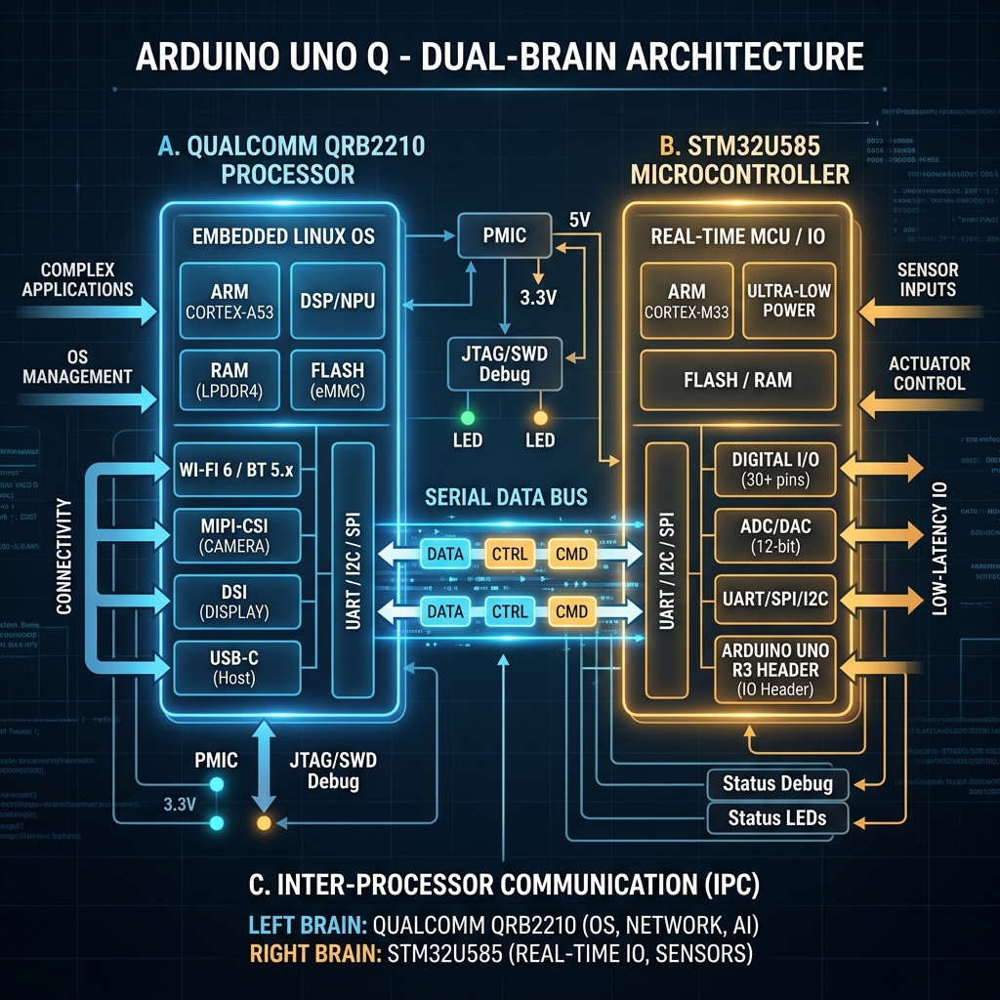

# Walkthrough: Realistic 3D Warehouse Separating Station Simulation

We have redesigned the conveyor simulation into a clean, realistic industrial 3D warehouse twin, directly matching the style of the 3D factory layout. The cyber-HMI panel has been replaced with light concrete tiles, concrete walls, security fences, beige control cabinets, and a clean minimalist UI.

---

## 3D Realistic Scenery Elements

The simulation renders a detailed warehouse environment:

### 1. Warehouse Architecture & Walls
* **Concrete Slab Floor**: Rendered as light concrete grey tiles (`#eceee9`) separated by slab seams and expansion joints.
* **Support Columns**: Light gray columns (`#c5c7c4`) extend vertically on the back warehouse wall, separated by column seams.
* **Wall Baseboard**: A dark slate baseboard joint outlines the wall-floor intersection line.

### 2. Blue-Steel Safety Fencing
* **Fence Panels**: Semitransparent wire mesh safety fences surround the machinery setup.
* **Mesh Details**: Detailed grid wires are drawn across the panels.
* **Steel Posts**: Blue square posts (`#3b82f6`) hold the fencing panels together, topped with yellow warning caps.

### 3. Pedestal Control Box
* **Stand**: A black vertical steel pipe column anchored by a floor flange.
* **Enclosure**: A beige electrical box (`#fef08a`) containing green (start), red (stop) pushbuttons, and a mushroom-head emergency stop dial.

### 4. Conveyors & Photo-eyes
* **Light Steel Frame**: Light gray conveyor frames (`#cbd5e1`) with black rubber belts and silver rollers replace the heavy dark frames.
* **Sensors**: Yellow cubic photo-eye modules mounted above the belts cast thin, clean red laser beams down to detect items.

### 5. UI Re-styling
* **Clean Frosted Panels**: All dashboard components, control sections, and event log containers use soft white backgrounds and clean, high-contrast slate text.
* **Inter Typography**: Standard Orbitron sci-fi fonts have been replaced with a clean, high-tech sans-serif font (`Inter`).
* **Telemetry Removal**: CRT scanlines, grid coordinates, and cyber HUD overlays have been removed.

---

## Upgraded Conveyor Scaling & AMR Reach Logistics

We have upgraded the simulation coordinates and animations to bring physical realism and mechanical depth to the conveyor and robot systems:

### 1. Realistic Conveyor Width Scaling
* **Proportionate Lanes**: The main conveyor belt width has been scaled from `30px` to `50px` (y = 125 to 175). Upper and lower branch conveyor lanes have been widened from `12px` to `24px`.
* **Proper Alignment**: Deflected green items now align exactly with the upper branch center `y = 134`, and blue items with the lower branch center `y = 166`. All conveyor rollers, leg supports, transition plates, and reject bin bounds have been adjusted to match.
* **Realistic Box Loading**: Deposition boxes and safety sensors align directly with the widened branch lane centers at `y = 134` and `y = 166`, preventing items from spilling over the belt edges.

### 2. AMR Reach Forklift & Aisle Navigation
* **Telescoping Reach Mechanism**: The AMR is equipped with a telescoping fork mechanism that extends forward by `0..38px`. A darker guide-base fork remains fixed to the mast, while a shiny chrome-plated extension fork slides out dynamically beneath the boxes.
* **Aisle Pathing**: To prevent structural collisions, the AMR drives along a dedicated warehouse aisle at `y = 81` (clear of the rack structures and conveyor frames).
* **Depositing Sequence**: The reach truck stops in front of the target rack slot, turns to face the rack (`angle = -Math.PI/2`), raises its lift mast if targeting the upper shelf, telescopes its forks forward to `y = 35` to deposit the box, lowers it onto the shelf surface, retracts the reach forks, lowers its empty forks back to travel height, and returns along the aisle.
* **Lifting Sequence**: The AMR stops slightly back at `x = 850` to leave space for its forks, telescopes them out to `x = 784` directly under the box, raises the lift mast (which smoothly raises the box's Z coordinate in sync), retracts the reach forks, and carries the load safely.
* **Standby Mode Visibility**: The AMR chassis, wheels, mast, and forks remain fully visible in standby mode at its parked staging position instead of disappearing when idle. In standby, the warning headlights, safety LIDAR sweep projections, and active flashing alarm lights are automatically turned off to conserve energy and match realistic warehouse guidelines.

### 3. Bug Fix: AMR Forklift Pickup Stuck-State
* **Issue**: When the simulation was scaled to high speed multipliers (e.g. 2x, 3x, 4x) or when the frame rate fluctuated, the step size `spd` exceeded the hardcoded `2px` margins in the state transitions. This caused the AMR to overshoot the target coordinates, leading to an infinite back-and-forth jittering oscillation (e.g., oscillating around `laneY` or `slot.x`), preventing it from ever docking, picking up, or depositing boxes.
* **Resolution**: Replaced the hardcoded boundaries with dynamic step-based boundaries (`spd` thresholds) and added coordinate snapping. Once the AMR is within the step distance of a target coord (e.g., `x = 850`, `y = targetY`, `y = aisleY`, or `x = slot.x`), it snaps precisely to the target values before transitioning to the next state, preventing any possibility of numerical overshoot or stuck states.

### 4. Bug Fix: Conveyor Chute Loop and Box Filling Failure
* **Issue**: Items reaching the end of the branch conveyor belts did not deposit into the cardboard boxes. This was caused by a state name conflict in `Item.update`: both the spawner entry chute and the branch exit chute used the state name `'chute'`. When items reached the end of the branch belt and set their state to `'chute'`, the engine evaluated the entry spawner conditional block first, which instantly warped items back to `x = 200` on the main belt, causing them to loop indefinitely on the conveyors and never fill the boxes.
* **Resolution**: Renamed the exit chute state to `'exit_chute'` to decouple it from the entry spawner chute. The items now correctly slide down the sloped gravity rollers and fall into the boxes.
* **Box Capacity Reduction**: As requested, the box capacity has been reduced from `4` items to `2` items. This ensures boxes fill up much quicker, triggering the AMR forklift pick-and-place operation more frequently.

---

## Realistic Objects & Physics Diverter Upgrades

We have added detailed physical simulation characteristics and scaled the visual assets for higher fidelity:

### 1. Tiny and Realistic Objects
* **Visual Scaling**: Items have been scaled down to realistic proportions (green bases: `radius = 8px`, blue lids: `radius = 7px`) so they appear like small, realistic parts on the large conveyor belts.
* **Bevels & Metallics**: Both items now render with rich 3D shading, realistic metallic base collars, bevel highlight strokes, specular reflections, and center cylinder cores.

### 2. 3D Miniature Box Deposits
* **Unified Rendering**: A new `drawItem3D` helper function renders items inside the cardboard boxes (when resting on the conveyor docks, carried by the AMR forklift, or stored on the warehouse racks).
* **3D Detail in Boxes**: Rather than flat colored circles, the items inside the boxes are rendered as high-fidelity, miniature 3D cylinder bases and dome caps scaled to `0.8x`, providing depth and authenticity.

### 3. Physics-Based Separation
* **Segment Intersection Collision**: The hardcoded Y deflection curves have been replaced with a real-time 2D line segment intersection solver.
* **Realistic Sliding**: As the servo horn gate rotates, items physically collide with the arm's surface and slide along its length, bouncing realistically into their target branch lanes based on the gate angle and speed.

---

## Optional Diagnostic Event Log

To maximize screen space and keep the interface clean, the diagnostic event log is now hidden by default and optional:
* **Hidden on Load**: The event log panel starts collapsed and does not occupy layout space on the screen.
* **Toggle Control**: An `EVENT LOG` button has been added to the control HUD.
* **Interactive Highlighting**: Clicking the `EVENT LOG` button shows/hides the event log panel instantly and toggles the button's active green status highlight to give clear visual feedback.

---

## Interactive RPC Data Flow Visualizer

To demonstrate how the RPC architecture works in real-time, we have built a dedicated **RPC Data Flow** view into the live simulation itself:

* **Animated Dual-Brain Schematic**: Replaces the warehouse camera view with a high-fidelity circuit schematic showing the **Qualcomm MPU (Linux Host)** and the **STM32 MCU (Arduino Client)** connected by a high-speed serial bus.
* **Real-time Packet Flow**: As items move through the simulation in the background, glowing packets travel across the communication bus in real-time to represent RPC calls:
  * `get_encoder_ticks`: Polled periodically by the MPU from the MCU.
  * `set_motor_speeds`: Commanded by the MPU based on speed multipliers.
  * `publish_sensor_state`: Sent by the MCU when the photo-eye detects parts.
  * `set_servo_angle`: Commanded by the MPU to trigger the diverter.
  * `dispatch_amr`: Commanded by the MPU to start the box transport.
* **Live Telemetry Monitor**: A terminal-style console log at the bottom displays a timestamped history of all RPC methods executing between the processors.

### Architecture Infographic Diagram

---

## Dynamic 3D Orbit & Zoom Camera Controls

To provide a fully interactive exploration of the digital twin, the fixed viewport angles have been upgraded to a **Free Orbit Camera**:
* **Interactive Drag-to-Rotate**: Click and drag your mouse cursor anywhere on the simulation canvas to rotate the camera. Drag horizontally to orbit horizontally (`camTheta`) and vertically to tilt the elevation angle (`camPhi`).
* **Interactive Scroll-to-Zoom**: Scroll the mouse wheel up or down inside the canvas to zoom in on specific components (e.g. details of the reach-fork picking sequence or 3D items inside boxes) or zoom out to see the entire warehouse layout.
* **Camera Presets**: The viewport buttons (Isometric, Top-down, Diverter Cam) act as instant focus presets, resetting the camera angles, zoom level, and center coordinates to targeted views.

---

## File Deliverables

The files inside the project directory [conveyor-separator-sim](file:///C:/Users/asus/.gemini/antigravity/scratch/conveyor-separator-sim/) are:

1. **[index.html](file:///C:/Users/asus/.gemini/antigravity/scratch/conveyor-separator-sim/index.html)**: Cleaned header and layouts.
2. **[style.css](file:///C:/Users/asus/.gemini/antigravity/scratch/conveyor-separator-sim/style.css)**: Modern, light industrial gray-concrete stylesheet.
3. **[sim.js](file:///C:/Users/asus/.gemini/antigravity/scratch/conveyor-separator-sim/sim.js)**: Contains floor polygon coordinates, safety fences, wider conveyor belts, telescoping reach forks drawing, unified 3D item rendering, and physics-based gate collision responses.

---

## How to Run & Verify

The Python web server is serving the redesigned code at:
👉 **[http://localhost:8080](http://localhost:8080)**

To run:
1. Double-click **`index.html`** in the project directory at `C:\Users\asus\.gemini\antigravity\scratch\conveyor-separator-sim\`.
2. Observe the clean 3D warehouse environment, wider belts, realistic miniature items, 3D deposits inside the boxes, and the physics-based servo horn gate arm deflection.
